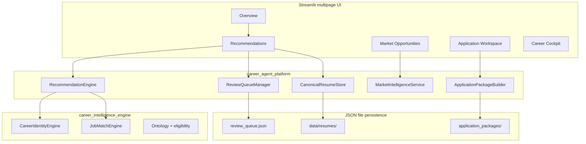
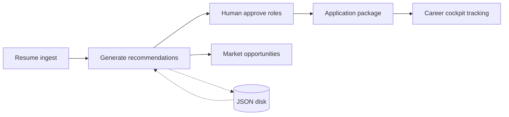
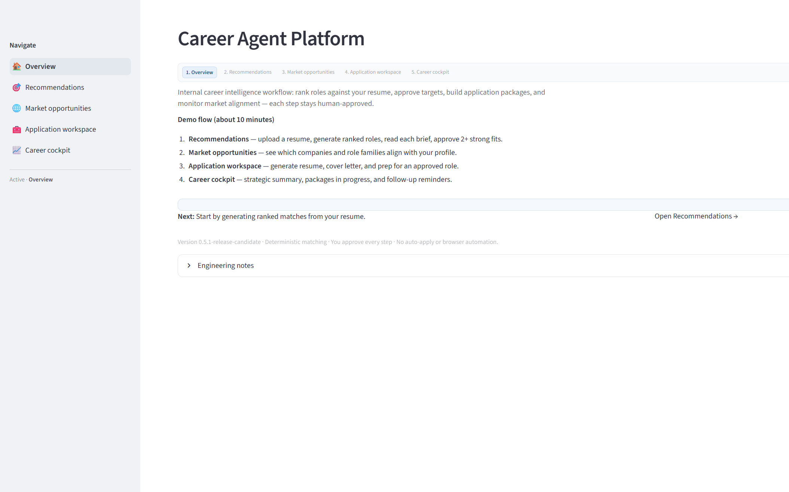
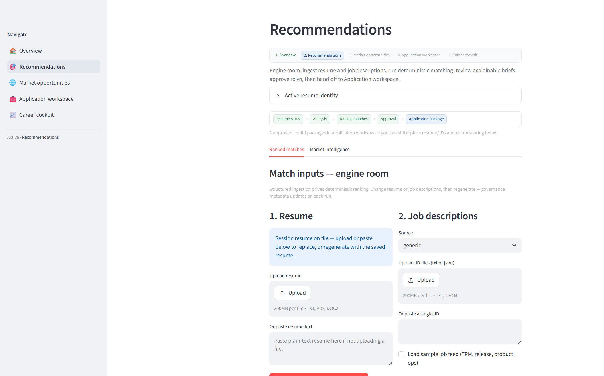
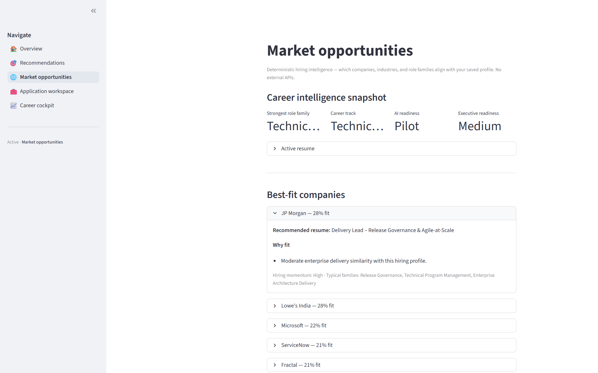
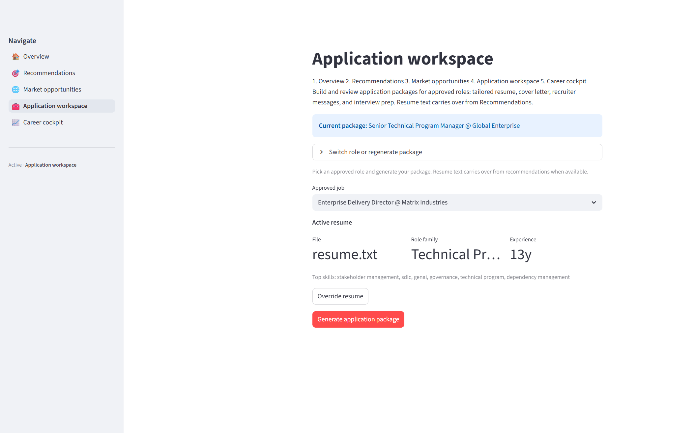
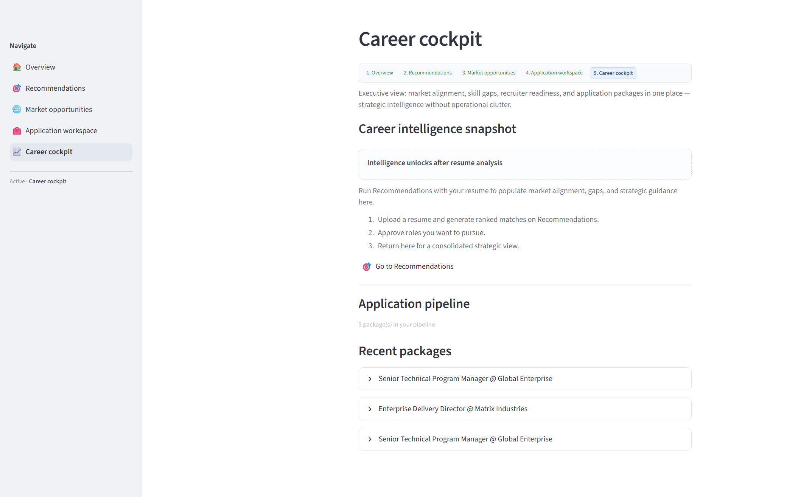

# Job Intelligence — Human-in-the-Loop Career Platform

[](../../actions/workflows/ci.yml)

**Release:** `0.5.1`  
**Stack:** Python 3.11+ · Streamlit · Deterministic matching · JSON persistence

A portfolio-grade career workflow that unifies resume analysis, explainable job ranking, human approval gates, application package generation, and pipeline tracking — built to demonstrate **systems engineering, program discipline, and product thinking**, not auto-apply SaaS.

| Quick links | |
|---|---|
| **5-minute demo script** | [docs/recruiter_demo_script.md](docs/recruiter_demo_script.md) |
| **Interview talking points** | [docs/interview_talking_points.md](docs/interview_talking_points.md) |
| **Architecture deep dive** | [docs/architecture_overview.md](docs/architecture_overview.md) |
| **Release validation** | [docs/RELEASE_REPORT.md](docs/RELEASE_REPORT.md) |

---

## 1. Project Overview

Job Intelligence is a **Streamlit multipage application** that guides a job seeker or career operator through a complete hiring workflow:

1. Parse a resume into an explainable career profile.
2. Rank job descriptions with transparent Fit and Confidence scores.
3. Approve roles in a review queue before any application artifact is created.
4. Generate tailored application packages (resume, cover letter, prep materials).
5. Track pipeline state on a Career cockpit — with **restart recovery** via JSON persistence.

The project demonstrates how to build a **trustworthy, auditable career tool** without relying on LLM variance for core ranking decisions. It is intentionally scoped for portfolio and architecture review: no auto-apply, no external job APIs in the default path, no database migrations.

---

## 2. Business Problem

Job seekers and career operators typically juggle **disconnected tools**:

| Pain point | Typical symptom |
|------------|-----------------|
| Fragmented workflow | Resume parsers, spreadsheets, job boards, and one-off cover letters live in separate tabs |
| Unpredictable rankings | LLM-based matching produces different scores on every run — hard to defend in a review |
| No audit trail | Decisions cannot be reproduced or explained to a recruiter or hiring manager |
| Lost state | Closing a browser tab or restarting the app wipes approvals, packages, and profile context |
| Compliance risk | Auto-apply tools bypass human judgment on role fit |

Job Intelligence addresses these as a **single deterministic workflow** with explicit human gates, explainable scores, and disk-backed persistence across process restarts.

---

## 3. Solution Overview

```
Resume + Job Descriptions
        │
        ▼
┌───────────────────────────────────────┐
│  Parse → Rank → Approve → Package     │
│  (deterministic engine + human gate)  │
└───────────────────────────────────────┘
        │
        ├── Session cache (per browser tab)
        └── JSON files (restart-safe: queue, resumes, packages)
```

**What this project is:** Systems and workflow engineering — persistence, restart recovery, evaluation gates, observability, and recruiter-readable UX.

**What this project is not:** Auto-apply SaaS, external job APIs in the default path, or LLM-dependent ranking.

**Key design choices:**

| Decision | Rationale |
|----------|-----------|
| Deterministic ontology matching | Same inputs → same scores; auditable for recruiters |
| Human approval queue | No package generation without explicit approve action |
| JSON file persistence | Restart recovery without database ops |
| Golden snapshot regression | Lock scoring behavior across releases |
| Governance panel | Recommendation hash, ontology version, benchmark signature logged per generation |

---

## 4. Architecture Diagram

### System layers



### Repository layout

| Path | Role |
|------|------|
| `career_agent_platform/` | Streamlit app, orchestration, persistence, tests |
| `career_intelligence_engine/` | Canonical deterministic matching engine (~109 modules) |
| `docs/` | Architecture, demo scripts, release evidence, screenshots |

**Runtime note:** The platform embeds a copy of the engine under `career_agent_platform/career_intelligence_engine/`. Set `PYTHONPATH=career_agent_platform` when running the app.

Full diagrams: [docs/architecture_diagram.md](docs/architecture_diagram.md) · [docs/persistence_flow.md](docs/persistence_flow.md)

---

## 5. End-to-End Workflow



| Step | Page | What happens |
|------|------|--------------|
| 1 | **Overview** | Journey rail, version, navigation to workflow |
| 2 | **Recommendations** | Upload/paste resume → parse identity → load job descriptions → generate ranked matches |
| 3 | **Recommendations** | Review Fit/Confidence cards → approve ≥ 2 roles → reject/archive weak fits |
| 4 | **Market opportunities** | Company/role-family fit snapshot and curated listing cards |
| 5 | **Application workspace** | Select approved role → generate package → export PDF/TXT |
| 6 | **Career cockpit** | Pipeline counts, intelligence tiles, recent package narratives |

**Presenter guide:** [docs/recruiter_demo_script.md](docs/recruiter_demo_script.md)  
**Detailed walkthrough:** [docs/demo_walkthrough.md](docs/demo_walkthrough.md)

---

## 6. Key Features

### Deterministic job matching

- Weighted scoring across capability similarity, eligibility, seniority, transformation, architecture, and governance dimensions.
- Same resume + same job descriptions → identical Fit/Confidence scores and sort order every time.
- No LLM in the default recommendation path.

### Explainability

- Recruiter-readable briefs, strengths, gaps, and fit lenses on every ranked card.
- Template-driven narrative phrasing (deterministic rotation, not model output).
- Governance expander: recommendation hash, ontology version, benchmark signature.

### Human-in-the-loop governance

- Review queue with Pending / Approved / Rejected / Decision memory states.
- Application packages require explicit approval — no automated applications.
- Demo-safe mode (`CAREER_AGENT_DEMO_MODE=1`) blocks persistence writes for public demos.

### Persistence and restart recovery

- Review queue, canonical resume, and application packages survive Streamlit process restarts.
- JSON artifacts under `applications/data/` and `data/resumes/` (gitignored at runtime).

### Application workspace

- Tailored resume, cover letter, recruiter messages, and interview prep per approved role.
- PDF and plain-text export with labeled match scores in headers.
- Package lifecycle state machine (generated → under review → approved → exported).

### Market intelligence

- In-process market snapshot from parsed profile — no external APIs in default path.
- Curated feed cards with LinkedIn search URLs (scrubbed of placeholder domains and synthetic job IDs).

### Quality gates

- **240+ automated tests** at release validation.
- Golden snapshot hash regression in CI.
- Listing URL hygiene guards against `example.com`, preview IDs, and synthetic links.

---

## 7. Technology Stack

| Area | Technology |
|------|------------|
| Language | Python 3.11+ (CI on 3.12) |
| UI | Streamlit multipage application |
| Data validation | Pydantic 2.x |
| Resume/JD parsing | pypdf, python-docx, custom parsers |
| Matching | Custom ontology + `JobMatchEngine` (deterministic weights) |
| Persistence | JSON files (queue, resumes, packages, active marker) |
| Export | ReportLab (PDF), plain-text export |
| Testing | pytest 8.3+, golden snapshot regression |
| CI | GitHub Actions (`ci.yml`) |
| Optional scaffolds | OpenAI SDK, Playwright (not required for core path) |

**Dependencies:** [requirements.txt](requirements.txt) → [career_agent_platform/requirements_agentic.txt](career_agent_platform/requirements_agentic.txt)

---

## 8. Testing & Validation

### Automated regression (CI required)

```powershell
cd career_agent_platform
$env:PYTHONPATH = (Get-Location).Path
pytest tests -q
pytest tests/test_golden_recommendations.py -q
```

| Suite | Result at release |
|-------|-------------------|
| Platform tests | **112 passed** |
| Engine tests (benchmark excluded) | **123 passed** |
| Golden recommendations | **5 passed** |
| Demo mode guards | **4 passed** |
| Golden idempotency | No hash drift on regenerate |

### Validation layers

| Layer | Purpose | Gate |
|-------|---------|------|
| Unit/integration tests | Platform orchestration, queue, workspace, URLs | CI blocking |
| Golden snapshots | Lock recommendation output hashes across releases | CI blocking |
| Engine regression | Ontology, matching, eligibility, explainability | CI blocking |
| Benchmark adjacency | Fixture staleness detection | Informational (4 known failures) |
| Manual UI gate | All five pages, no exceptions, link hygiene | Portfolio demo |
| Demo mode | Persistence write blocking | CI blocking |

**Evidence:** [docs/RELEASE_REPORT.md](docs/RELEASE_REPORT.md) · [docs/evaluation_strategy.md](docs/evaluation_strategy.md)

### Quick start (local demo)

```powershell
git clone <repo-url> JobIntelligence
cd JobIntelligence/career_agent_platform
python -m venv venv
.\venv\Scripts\Activate.ps1
pip install -r ..\requirements.txt
$env:PYTHONPATH = (Get-Location).Path
streamlit run Home.py
```

Use fictional demo data: paste `demo/public/sample_resume.txt` and enable **Load sample job feed**.

**Troubleshooting:** [docs/DEVELOPER.md](docs/DEVELOPER.md)

---

## 9. Screenshots

| Preview | Page | Description |
|---------|------|-------------|
|  | Overview | Navigation, journey rail, version caption |
|  | Recommendations | Ranked cards with Fit/Confidence chips |
|  | Market opportunities | Company fit snapshot and listing cards |
|  | Application workspace | Package generation and export |
|  | Career cockpit | Pipeline counts and intelligence tiles |

Capture procedure and privacy checklist: [docs/screenshots/README.md](docs/screenshots/README.md)

---

## 10. Future Roadmap

The application is **feature-frozen** at `0.5.1`. Planned work is documentation, hygiene, and evaluation tooling — **not new features, agents, or scoring changes**:

| Item | Intent |
|------|--------|
| `0.6.0-evaluation-layer` | Expand snapshot/diff tooling and governance diagnostics |
| MIT LICENSE | Published at repository root |
| Engine sync CI check | Detect drift between root and embedded engine copies |
| File locking / single-writer | Reduce `review_queue.json` race under concurrent tabs |
| Cross-page profile hydration | Close DEF-001 (Market/Cockpit without re-generate) |
| Post-portfolio hygiene | Ruff F401 cleanup, orphan scaffold removal |

See [CHANGELOG.md](CHANGELOG.md) · [docs/operational_risks.md](docs/operational_risks.md)

---

## Known limitations

- File-based persistence — last-write-wins if multiple Streamlit tabs write concurrently (DEF-005).
- Market/Cockpit require `parsed_profile` on canonical resume — generate in-session before those pages (DEF-001).
- No auto-apply — browser automation is scaffold-only.
- Dual engine copies — keep in sync when developing scoring (post-release concern).

---

## Safety & privacy

- Runtime user data is **gitignored** (`data/resumes/`, `applications/data/`).
- Public demo artifacts are **fictional** ([demo/public/](career_agent_platform/demo/public/)).
- No credentials required for core flows.

---

## Documentation index

| Document | Audience |
|----------|----------|
| [recruiter_demo_script.md](docs/recruiter_demo_script.md) | 5-minute live demo walkthrough |
| [interview_talking_points.md](docs/interview_talking_points.md) | Architecture and TPM interview prep |
| [portfolio_summary.md](docs/portfolio_summary.md) | Executive portfolio brief |
| [demo_walkthrough.md](docs/demo_walkthrough.md) | Step-by-step demo with expected outcomes |
| [architecture_overview.md](docs/architecture_overview.md) | Layer and page responsibilities |
| [RELEASE_REPORT.md](docs/RELEASE_REPORT.md) | Release validation and defect register |
| [code_quality_audit.md](docs/code_quality_audit.md) | Dead code, duplicates, publication gaps |

---

## License

[MIT](LICENSE) — engine and platform are intended for portfolio and architecture review.
