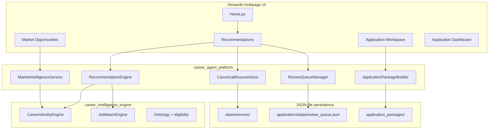
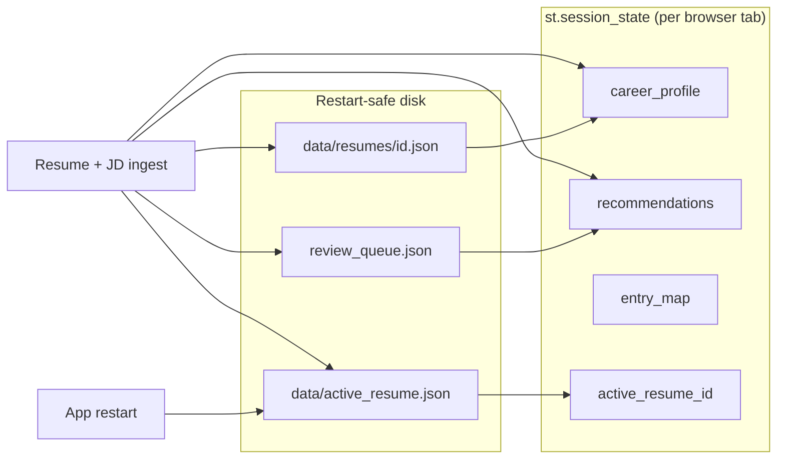
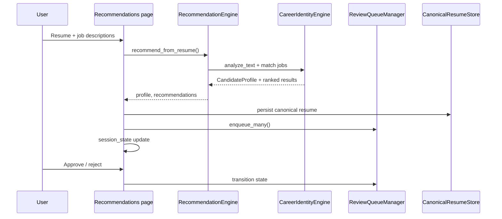
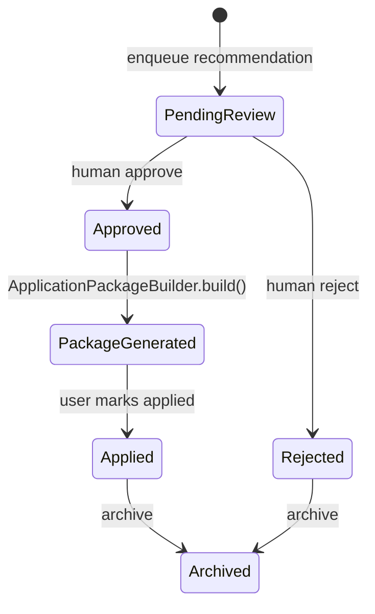
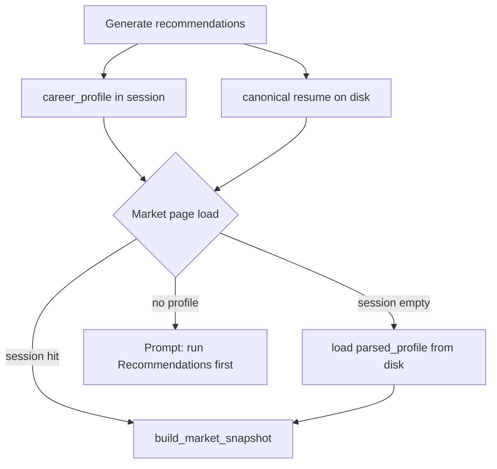

# Architecture diagrams

Mermaid diagrams for the Career Agent Platform. Render on GitHub or any Mermaid-capable viewer.

## System layers

## Session state flow

## Recommendation generation flow

## Package lifecycle

## Market Opportunities dependency chain

