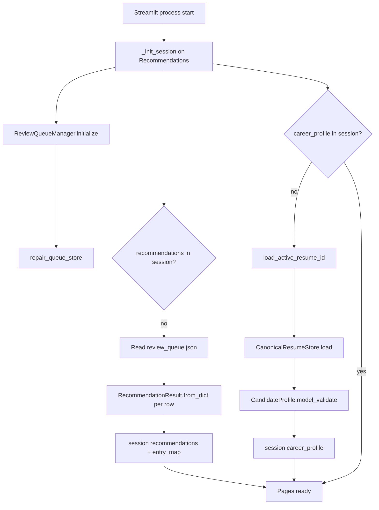
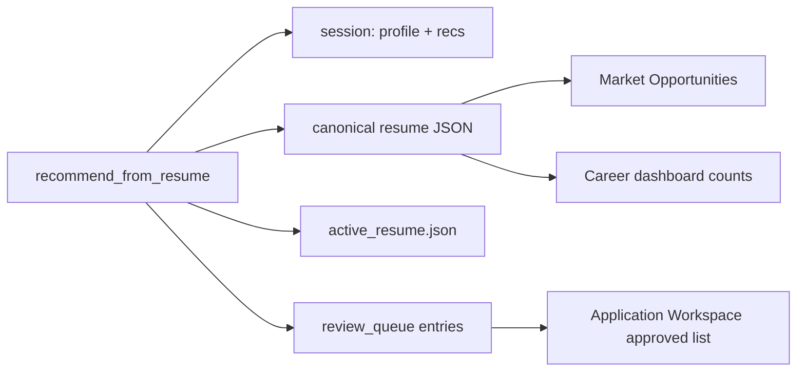
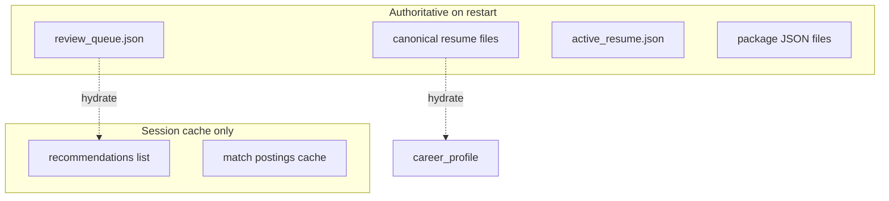
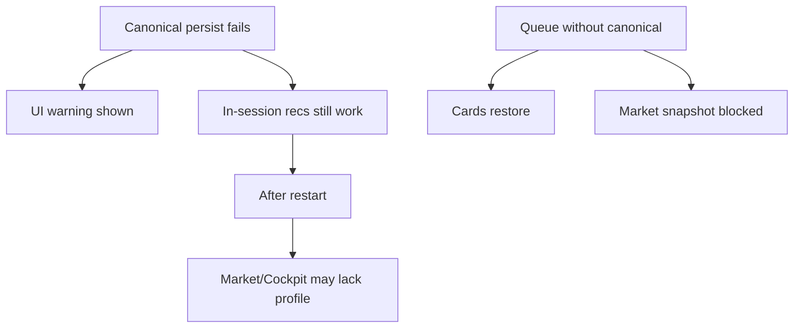

# Persistence diagrams

How disk and session cooperate across restarts.

## Persistence restore flow (cold start)

## Write path after generation

## Data ownership

## Failure modes (documented, not auto-fixed)

